# Innova Digital — Plataforma web PWA de servicios digitales

**Emprendimiento:** Servicios Digitales (Proyecto Productivo SENATIC, Rionegro, Antioquia)
**Eslogan:** "Conectamos ideas, impulsamos resultados."
**Stack:** React + Vite PWA + Tailwind CSS · Node.js · MySQL en Clever Cloud
**Roles:** Administrador, Vendedor, Cliente (más el visitante público, sin cuenta)

## 0. Cómo se conecta la plataforma con el documento del proyecto

| Elemento del documento | Cómo se refleja en la plataforma |
|---|---|
| Servicios: redes sociales, diseño gráfico, edición de video, creación de contenido, páginas web, publicidad en línea, asesoría | Categorías del catálogo |
| "Diagnóstico inicial de las necesidades de cada cliente" | Formulario de diagnóstico (briefing) ligado a cada pedido |
| "Atención personalizada" y "acompañamiento continuo" | Chat por pedido, cotizaciones a medida, tickets de soporte |
| Calidad como factor más importante (73,7 %) | Reseñas, calificaciones y portafolio de trabajos |
| Contacto por WhatsApp, página web e Instagram (encuesta) | Botón de WhatsApp Business, enlaces a Instagram/Facebook |
| Encuesta de Servicios Digitales (plan de trabajo) | Módulo de encuestas con resultados en porcentajes |
| Producto Mínimo Viable (PMV) como evidencia final | Columna "Prioridad" (A = entra al PMV) |

---

## 1. Requisitos funcionales (RF)

Prioridad: **A** = PMV (entrega final), **M** = segunda fase, **B** = mejora futura.

### 1.1 Visitante público (sin cuenta)
| ID | Requisito | Prioridad |
|----|-----------|-----------|
| RF-01 | Ver la página de inicio con presentación de la empresa, misión, visión, valores y eslogan. | A |
| RF-02 | Consultar el catálogo público de servicios por categoría. | A |
| RF-03 | Ver el portafolio de trabajos realizados. | A |
| RF-04 | Contactar por WhatsApp Business (botón flotante) y acceder a Instagram y Facebook. | A |
| RF-05 | Responder la Encuesta de Servicios Digitales sin registrarse, aceptando el tratamiento de datos. | A |

### 1.2 Comunes (todos los roles con cuenta)
| ID | Requisito | Prioridad |
|----|-----------|-----------|
| RF-06 | Registro de clientes con nombre, correo y contraseña. | A |
| RF-07 | Inicio y cierre de sesión (JWT). | A |
| RF-08 | Recuperación de contraseña por correo. | M |
| RF-09 | Control de acceso por rol (RBAC) a cada módulo. | A |
| RF-10 | Ver y editar perfil, incluido el canal de contacto preferido (WhatsApp, correo, Instagram). | A |
| RF-11 | Recibir notificaciones dentro de la app y notificaciones push (PWA) sobre cambios de estado. | M |

### 1.3 Cliente
| ID | Requisito | Prioridad |
|----|-----------|-----------|
| RF-12 | Buscar y filtrar servicios por categoría y precio. | A |
| RF-13 | Ver el detalle de un servicio: descripción, paquetes, tiempo de entrega y reseñas. | A |
| RF-14 | Agregar servicios al carrito y modificar cantidades/paquetes. | A |
| RF-15 | Confirmar el pedido y elegir método de pago. | A |
| RF-16 | Diligenciar el diagnóstico inicial de su negocio (objetivos, público, redes actuales, referencias). | A |
| RF-17 | Solicitar una cotización personalizada a un vendedor. | M |
| RF-18 | Consultar el historial y estado de sus pedidos. | A |
| RF-19 | Chatear con el vendedor dentro de cada pedido. | M |
| RF-20 | Descargar los entregables, aprobar el trabajo o solicitar ajustes. | A |
| RF-21 | Calificar y comentar un servicio entregado. | M |
| RF-22 | Abrir tickets de soporte o reclamos sobre un pedido. | M |
| RF-23 | Guardar servicios en favoritos. | B |

### 1.4 Vendedor
| ID | Requisito | Prioridad |
|----|-----------|-----------|
| RF-24 | Crear, editar, pausar y eliminar sus servicios y paquetes. | A |
| RF-25 | Gestionar su portafolio (trabajos con imágenes o video). | M |
| RF-26 | Ver sus pedidos, revisar el diagnóstico del cliente y actualizar el estado. | A |
| RF-27 | Responder y enviar cotizaciones personalizadas. | M |
| RF-28 | Subir entregables y marcar el pedido como entregado. | A |
| RF-29 | Responder mensajes del cliente. | M |
| RF-30 | Consultar su panel personal: pedidos por estado, ingresos y calificación promedio. | M |

### 1.5 Administrador
| ID | Requisito | Prioridad |
|----|-----------|-----------|
| RF-31 | Gestionar usuarios: crear, editar, activar/desactivar y asignar rol. | A |
| RF-32 | Aprobar o rechazar servicios publicados por los vendedores. | A |
| RF-33 | Gestionar las categorías de servicios. | A |
| RF-34 | Supervisar todos los pedidos y pagos, y registrar reembolsos. | A |
| RF-35 | Reasignar un pedido a otro vendedor. | B |
| RF-36 | Gestionar cupones y promociones. | B |
| RF-37 | Crear, publicar y cerrar encuestas; ver resultados en porcentajes y exportarlos. | A |
| RF-38 | Atender y resolver tickets de soporte. | M |
| RF-39 | Moderar reseñas y contenido del portafolio. | M |
| RF-40 | Ver dashboard de métricas y exportar reportes (PDF/Excel). | M |
| RF-41 | Consultar el registro de auditoría de acciones críticas. | B |

---

## 2. Requisitos no funcionales (RNF)

| ID | Categoría | Requisito |
|----|-----------|-----------|
| RNF-01 | PWA | Instalable en móvil y escritorio (manifest, íconos 192/512 px). |
| RNF-02 | PWA | Funcionamiento offline parcial con Service Worker (catálogo y pedidos ya consultados). |
| RNF-03 | PWA | Notificaciones push y sincronización en segundo plano. |
| RNF-04 | Rendimiento | Carga inicial (LCP) menor a 2,5 s en 4G y puntaje Lighthouse ≥ 90. |
| RNF-05 | Rendimiento | API con respuesta menor a 500 ms en el 95 % de las consultas. |
| RNF-06 | Usabilidad | Diseño responsive *mobile-first* con Tailwind; los clientes llegan sobre todo desde el celular. |
| RNF-07 | Accesibilidad | Cumplir WCAG 2.1 nivel AA (contraste, teclado, textos alternativos). |
| RNF-08 | Identidad | Interfaz con la identidad visual del proyecto: azul, verde y blanco, logo y eslogan. |
| RNF-09 | Seguridad | Contraseñas con bcrypt; autenticación JWT con refresh token. |
| RNF-10 | Seguridad | HTTPS/TLS, consultas parametrizadas, protección contra XSS y CSRF, límite de intentos (rate limiting). |
| RNF-11 | Seguridad | Validación de datos en cliente y servidor. Responde a la amenaza del DOFA sobre seguridad informática y pérdida de información. |
| RNF-12 | Privacidad | Cumplir la Ley 1581 de 2012: consentimiento explícito en registro y encuesta. |
| RNF-13 | Disponibilidad | Disponibilidad objetivo ≥ 99 % mensual. Responde a la debilidad del DOFA sobre la dependencia de internet. |
| RNF-14 | Datos | Copias de seguridad automáticas de MySQL. |
| RNF-15 | Costo | Operar con planes gratuitos o de bajo costo, coherente con el presupuesto estudiantil del proyecto. Usar un pool de conexiones pequeño hacia MySQL por los límites del plan. |
| RNF-16 | Escalabilidad | API REST sin estado, apta para escalar horizontalmente. |
| RNF-17 | Mantenibilidad | Código modular por capas (rutas, controladores, servicios, modelos), en Git/GitHub, con API documentada (OpenAPI). |
| RNF-18 | Compatibilidad | Últimas 2 versiones de Chrome, Edge, Firefox, Safari y navegadores móviles. |
| RNF-19 | Calidad | Pruebas de los flujos críticos: autenticación, pedidos y encuesta. |
| RNF-20 | Localización | Interfaz en español, moneda COP y fechas en formato local. |

---

## 3. Historias de usuario

> Formato: *Como [rol], quiero [acción], para [beneficio].*

### Visitante
**HU-01 Conocer la empresa** — Como visitante, quiero ver quiénes son, qué servicios ofrecen y su portafolio, para decidir si confío en ellos.

**HU-02 Contactar rápido** — Como visitante, quiero escribirles por WhatsApp o Instagram desde la página, para resolver mis dudas en el medio que uso.

**HU-03 Responder la encuesta** — Como visitante, quiero responder la encuesta de servicios digitales sin crear una cuenta, para dar mi opinión rápidamente.
*Criterios:* debe aceptar el tratamiento de datos; no puede enviar dos veces con el mismo correo.

### Cliente
**HU-04 Registro e inicio de sesión** — Como cliente, quiero registrarme e iniciar sesión, para solicitar servicios y seguir mis pedidos.

**HU-05 Explorar servicios** — Como cliente, quiero filtrar por categoría (redes, diseño, video, contenido, web, publicidad, asesoría) y precio, para encontrar lo que necesito.

**HU-06 Ver detalle** — Como cliente, quiero ver paquetes, tiempos de entrega y reseñas, para comparar antes de comprar.

**HU-07 Carrito y pedido** — Como cliente, quiero agregar servicios al carrito y confirmar mi pedido, para contratar varios servicios a la vez.
*Criterios:* si el carrito mezcla vendedores, se crean pedidos separados.

**HU-08 Diagnóstico inicial** — Como cliente, quiero contar cómo es mi negocio, mis objetivos y mi público, para que el vendedor diseñe una estrategia a mi medida.

**HU-09 Cotización personalizada** — Como cliente, quiero pedir una cotización a medida, para proyectos que no están en el catálogo.

**HU-10 Seguimiento** — Como cliente, quiero ver el estado de mis pedidos, para saber cuándo recibiré mi servicio.

**HU-11 Chat con el vendedor** — Como cliente, quiero escribir al vendedor dentro del pedido, para aclarar requerimientos y recibir acompañamiento.

**HU-12 Revisar entrega** — Como cliente, quiero descargar los entregables y aprobarlos o pedir ajustes, para asegurar la calidad del resultado.

**HU-13 Calificar** — Como cliente, quiero calificar y comentar el servicio recibido, para ayudar a otros clientes.
*Criterios:* solo pedidos entregados; una reseña por pedido.

**HU-14 Soporte** — Como cliente, quiero abrir un ticket, para reportar problemas con un pedido.

**HU-15 Instalar la app** — Como cliente, quiero instalar la PWA en mi celular, para abrirla como una app.

### Vendedor
**HU-16 Publicar servicios** — Como vendedor, quiero crear servicios con paquetes, precios e imágenes, para ofrecerlos en el catálogo.
*Criterios:* quedan pendientes de aprobación hasta que el administrador los apruebe.

**HU-17 Mostrar mi portafolio** — Como vendedor, quiero subir trabajos realizados, para demostrar la calidad de mi trabajo.

**HU-18 Gestionar pedidos** — Como vendedor, quiero ver mis pedidos junto con el diagnóstico del cliente y cambiar su estado, para organizar el trabajo.

**HU-19 Entregar trabajos** — Como vendedor, quiero subir los archivos y marcar el pedido como entregado, para cerrar el servicio.

**HU-20 Cotizar** — Como vendedor, quiero responder solicitudes con una cotización, para atender proyectos personalizados.

**HU-21 Atender mensajes** — Como vendedor, quiero responder a mis clientes, para dar una atención rápida.

**HU-22 Mi panel** — Como vendedor, quiero ver mis pedidos, ingresos y calificación promedio, para medir mi desempeño.

### Administrador
**HU-23 Gestionar usuarios** — Como administrador, quiero crear, editar y desactivar usuarios y asignar roles, para controlar el acceso.

**HU-24 Aprobar servicios** — Como administrador, quiero aprobar o rechazar servicios, para mantener la calidad del catálogo.

**HU-25 Categorías** — Como administrador, quiero gestionar las categorías, para organizar la oferta.

**HU-26 Supervisar pedidos y pagos** — Como administrador, quiero ver todos los pedidos y pagos, para resolver incidencias y reembolsos.

**HU-27 Gestionar encuestas** — Como administrador, quiero crear encuestas y ver los resultados en porcentajes, para conocer las necesidades del mercado.

**HU-28 Atender soporte** — Como administrador, quiero responder los tickets, para solucionar los reclamos de los clientes.

**HU-29 Moderar contenido** — Como administrador, quiero ocultar reseñas o trabajos inapropiados, para cuidar la imagen de la empresa.

**HU-30 Reportes** — Como administrador, quiero un dashboard y reportes exportables, para tomar decisiones y documentar evidencias del proyecto.

**HU-31 Auditoría** — Como administrador, quiero consultar quién hizo qué acciones críticas, para garantizar trazabilidad.

---

## 4. Modelo entidad-relación

```mermaid
erDiagram
    ROLES ||--o{ USUARIOS : "tiene"
    USUARIOS ||--o| PERFILES_VENDEDOR : "extiende"
    USUARIOS ||--o{ SERVICIOS : "publica"
    USUARIOS ||--o{ PORTAFOLIO : "muestra"
    CATEGORIAS ||--o{ SERVICIOS : "clasifica"
    CATEGORIAS ||--o{ PORTAFOLIO : "clasifica"
    SERVICIOS ||--o{ PAQUETES_SERVICIO : "ofrece"
    SERVICIOS ||--o{ IMAGENES_SERVICIO : "tiene"
    USUARIOS ||--o| CARRITOS : "posee"
    CARRITOS ||--o{ ITEMS_CARRITO : "contiene"
    SERVICIOS ||--o{ ITEMS_CARRITO : "se agrega"
    USUARIOS ||--o{ FAVORITOS : "guarda"
    SERVICIOS ||--o{ FAVORITOS : "es favorito"
    CUPONES ||--o{ PEDIDOS : "se aplica"
    USUARIOS ||--o{ PEDIDOS : "solicita (cliente)"
    USUARIOS ||--o{ PEDIDOS : "atiende (vendedor)"
    PEDIDOS ||--|{ DETALLE_PEDIDO : "contiene"
    SERVICIOS ||--o{ DETALLE_PEDIDO : "se vende en"
    PEDIDOS ||--o| BRIEFINGS : "tiene diagnostico"
    PEDIDOS ||--o{ PAGOS : "se paga con"
    PEDIDOS ||--o{ ENTREGABLES : "genera"
    PEDIDOS ||--o{ MENSAJES : "tiene chat"
    USUARIOS ||--o{ MENSAJES : "envia"
    PEDIDOS ||--o| RESENAS : "recibe"
    SERVICIOS ||--o{ RESENAS : "es valorado"
    USUARIOS ||--o{ COTIZACIONES : "solicita / envia"
    USUARIOS ||--o{ TICKETS_SOPORTE : "abre"
    PEDIDOS ||--o{ TICKETS_SOPORTE : "se relaciona"
    USUARIOS ||--o{ NOTIFICACIONES : "recibe"
    USUARIOS ||--o{ AUDITORIA : "genera"
    ENCUESTAS ||--|{ PREGUNTAS_ENCUESTA : "incluye"
    PREGUNTAS_ENCUESTA ||--o{ OPCIONES_PREGUNTA : "ofrece"
    ENCUESTAS ||--o{ PARTICIPACIONES_ENCUESTA : "recibe"
    PARTICIPACIONES_ENCUESTA ||--|{ RESPUESTAS_ENCUESTA : "contiene"
    PREGUNTAS_ENCUESTA ||--o{ RESPUESTAS_ENCUESTA : "se responde"
    OPCIONES_PREGUNTA ||--o{ RESPUESTAS_ENCUESTA : "se elige"

    ROLES {
        int id_rol PK
        varchar nombre
    }
    USUARIOS {
        int id_usuario PK
        int id_rol FK
        varchar nombre
        varchar correo
        varchar password_hash
        varchar telefono
        enum canal_contacto
        boolean activo
    }
    PERFILES_VENDEDOR {
        int id_usuario PK
        text biografia
        decimal calificacion_promedio
    }
    CATEGORIAS {
        int id_categoria PK
        varchar nombre
        boolean activa
    }
    SERVICIOS {
        int id_servicio PK
        int id_vendedor FK
        int id_categoria FK
        varchar titulo
        text descripcion
        decimal precio_base
        int dias_entrega
        enum estado
    }
    PAQUETES_SERVICIO {
        int id_paquete PK
        int id_servicio FK
        varchar nombre
        decimal precio
        int dias_entrega
    }
    IMAGENES_SERVICIO {
        int id_imagen PK
        int id_servicio FK
        varchar url
    }
    PORTAFOLIO {
        int id_portafolio PK
        int id_vendedor FK
        int id_categoria FK
        varchar titulo
        varchar media_url
        boolean visible
    }
    CARRITOS {
        int id_carrito PK
        int id_cliente FK
    }
    ITEMS_CARRITO {
        int id_item PK
        int id_carrito FK
        int id_servicio FK
        int id_paquete FK
        int cantidad
    }
    FAVORITOS {
        int id_cliente PK
        int id_servicio PK
    }
    CUPONES {
        int id_cupon PK
        varchar codigo
        enum tipo
        decimal valor
        boolean activo
    }
    PEDIDOS {
        int id_pedido PK
        int id_cliente FK
        int id_vendedor FK
        int id_cupon FK
        decimal total
        enum estado
    }
    DETALLE_PEDIDO {
        int id_detalle PK
        int id_pedido FK
        int id_servicio FK
        int id_paquete FK
        int cantidad
        decimal precio_unitario
    }
    BRIEFINGS {
        int id_briefing PK
        int id_pedido FK
        varchar nombre_negocio
        text objetivos
        text publico_objetivo
        text redes_actuales
    }
    PAGOS {
        int id_pago PK
        int id_pedido FK
        enum metodo
        decimal monto
        enum estado
    }
    ENTREGABLES {
        int id_entregable PK
        int id_pedido FK
        varchar archivo_url
        enum estado_revision
    }
    MENSAJES {
        int id_mensaje PK
        int id_pedido FK
        int id_emisor FK
        text contenido
    }
    RESENAS {
        int id_resena PK
        int id_pedido FK
        int id_servicio FK
        int id_cliente FK
        tinyint calificacion
        boolean visible
    }
    COTIZACIONES {
        int id_cotizacion PK
        int id_cliente FK
        int id_vendedor FK
        text descripcion
        decimal monto
        enum estado
    }
    TICKETS_SOPORTE {
        int id_ticket PK
        int id_usuario FK
        int id_pedido FK
        varchar asunto
        enum estado
    }
    NOTIFICACIONES {
        int id_notificacion PK
        int id_usuario FK
        varchar titulo
        boolean leida
    }
    AUDITORIA {
        int id_auditoria PK
        int id_usuario FK
        varchar accion
        varchar entidad
    }
    ENCUESTAS {
        int id_encuesta PK
        varchar titulo
        enum estado
    }
    PREGUNTAS_ENCUESTA {
        int id_pregunta PK
        int id_encuesta FK
        varchar enunciado
        enum tipo
    }
    OPCIONES_PREGUNTA {
        int id_opcion PK
        int id_pregunta FK
        varchar texto
    }
    PARTICIPACIONES_ENCUESTA {
        int id_participacion PK
        int id_encuesta FK
        int id_usuario FK
        varchar correo
        boolean consentimiento
    }
    RESPUESTAS_ENCUESTA {
        int id_respuesta PK
        int id_participacion FK
        int id_pregunta FK
        int id_opcion FK
        text texto
    }
```

### Reglas de negocio clave
- Un usuario tiene un solo rol; el vendedor tiene además un perfil.
- Cada pedido pertenece a un cliente y a un vendedor. Si el carrito mezcla vendedores, el backend crea un pedido por vendedor.
- Cada pedido puede tener un diagnóstico (briefing) que el cliente diligencia al comprar.
- Solo se puede reseñar un pedido `entregado`, una única vez.
- Los servicios nuevos quedan `pendiente` hasta que el administrador los apruebe.
- La encuesta admite participantes sin cuenta (correo opcional) y exige consentimiento de tratamiento de datos.
- Se eliminó el modelo de comisiones porque el proyecto opera sin salarios ni prestaciones, como indica el documento.
